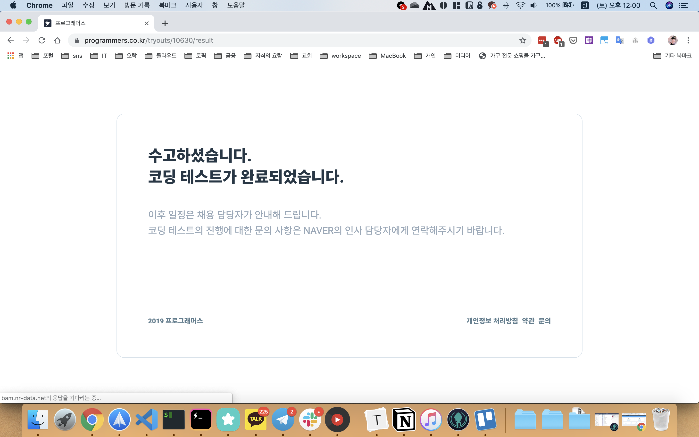
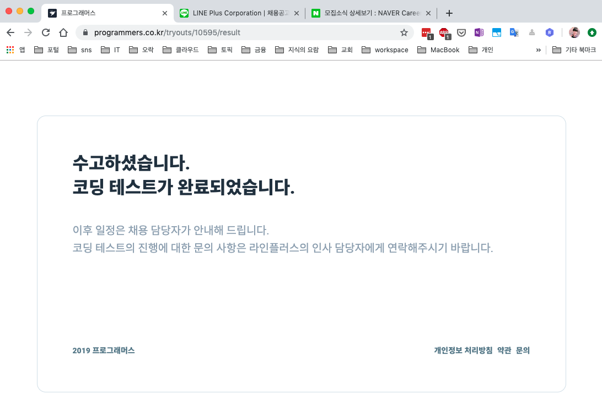

<!--truncate-->

2019년 하반기 카카오(신입), 네이버(신입), 라인(인턴 전환)에서 정규직 채용 코딩 테스트를 봤습니다. 기업 기술 순서는 그저 테스트 시험일 순입니다.

코딩 테스트 경험이 없어서 긴장을 많이 했었습니다.

카카오의 경우 블라인드 채용이라 테스트를 먼저 봤고, 네이버와 라인은 서류가 먼저 있었습니다. 그렇지만 라인의 경우 서류라고 해도 간단한 인적사항만 넣어서 제 생각엔 아무 생각 없이 지원하는 사람들 선별하려고 넣은 과정이 아니었나 생각했습니다.

세 곳 모두 [프로그래머스](https://programmers.co.kr/)에서 테스트를 진행했습니다. 프로그래머스에서 테스트나 프로그래머스에서 제공하는 알고리즘을 풀어보신 분들은 아시겠지만, 프로그래머스는 "실행"과 "제출"로 나뉘어집니다. "실행"은 문제에서 제공해주는 테스트 케이스를 실행해서 결과를 보여주는 것이구요. "제출"은 완성한 알고리즘을 전송하면 내부적으로 응시자가 알 수 없는 테스트 케이스를 실행하면서 정확성(과 효율성)을 체크합니다. 또한 제출된 문제들은 언제든지 몇 번 문제를 풀지 선택할 수 있습니다.

## 테스트 타임

- 카카오 5시간
- 네이버 2시간
- 라인 3시

시험 시간의 경우 카카오가 제일 길었습니다. 그렇지만 단점도 있었는데요. 카카오의 경우 코드를 제출하면 테스트가 진행되더라구요. 그런데 이 테스트 케이스가 정확성 몇 개, 효율성 몇 개 이렇게 실행이 되는데 단 하나만 실패해도 통과가 안됩니다. 저의 경우 예를 들어 1번 문제에서 정확성 테스트만 50개였다면 49/50개가 성공해서 1개 때문에 1번 문제 제출이 안됐습니다. 3? 4?번 문제도 마찬가지로 정확성 30/30, 효율성 4/5로 통과를 못했습니다. 그러다보니 계속 그 문제에 집착하게 되고 계속 다른 문제로 넘어가지 못하고 있었습니다. 그러다가 무려 5시간임에도 불구하고 카카오 문제는 한문제도 통과를 못했습니다. 겨우 두 문제 풀고 붙잡고 있었어요.... ㅠㅠ

네이버와 라인은 그런 부담이 없었습니다. 실행은 가능하나 제출하면 테스트가 돌지 않고 그냥 제출로 끝납니다. 그래서 개인적으로 열심히 생각해보고 문제 없겠다 생각이 들면 그냥 다른 문제로 넘어가서 풀면 됐습니다. 그래서 네이버와 라인은 훨씬 적은 시간임에도 모든 문제를 볼 수 있는 시간적 여유가 충분했습니다. 다만, 시간이 적다보니 상당이 쫄깃쫄깃 스릴 넘치는 맛이 있습니다... ㅎ;

## 문제 갯수

- 카카오 6문제
- 네이버 3문제
- 라인 6문제

문제 갯수는 사실 별로 할 말이 없는게 문제에 익숙한 정도의 차이인 것 같아요. 알고리즘 문제를 많이 풀어보면 답에 대한 접근 방향이 빨리 서겠더라구요. 알알못인 저에게는... ㅎ;

카카오는 위에서 얘기한 것과 같이 0/6문제 풀었구요. 네이버는 3/3 다 풀었습니다. 라인은 4/6문제 풀었는데 20~60초만 더 있었으면 냈는데 ㅠㅠㅠ 1자리대 초 남겨 놓고 제출하고 나서 보니 치명적인 실수가 ㅠㅠㅠㅠ 그후에 바로 고쳤는데 이미 끝... 그때의 절망감이란 ㅎㅎㅎㅎㅎㅎ

## 난이도

- 카카오 중상
- 네이버 하중
- 라인 중

난이도는 시간이랑 비례했다고 생각이 드네요. 문제 자체가 풀지 못할정도로 어려웠다기보다 시간내에 알고리즘을 구상하고 정리하고 최적화하는 것에 대해서 많이 요구 되었다고 생각이 들어요.

## 결과

카카오는 당연히 떨어졌구요 ㅎㅎ. 라인도 최근에 결과를 이메일로 받았는데 떨어졌습니다. 라인은 아쉬움이 많이 남네요.
