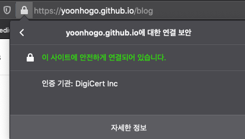

### intro.

너무 당연하게 패스워드는 클라이언트에서 해싱 후에 서버에 보내서 가공해야한다고 생각했습니다.
그게 보안적으로 좀 더 안전하다고 생각했기 때문인데요.
지인에게 2차 비밀번호 평문을 HTTPS(TLS v1.2 이상)로 보냈을 때 무슨 문제가 있는가에 대한 질문을 받았습니다.
저는 당연히 해시를 해서 보내야 한다고 생각만 해봤지 왜인가에 대해서 충분히 생각해보지 못했음을 깨닫고 조사를 해봤습니다.
(물론 데이터베이스에 저장할 때는 해시를 한다는 가정입니다.) 그래서 오늘은 HTTPS를 사용할 때 패스워드를 평문을 보내도 되는지에 대해서 조사해봤습니다.

<!--truncate-->

## HTTPS로 평문 패스워드를 보내면 안전한가?

우선, HTTPS로 평문을 보낼때 문제가 있을까요?

생각해볼 수 있는 경우는 세가지가 있습니다.

1. Client Side
1. MITM(Man in the middle)
1. Server Side

이 세가지의 입장에서 살펴보겠습니다.

### 1. Client Side

클라이언트의 입장에서 평문을 보낼 때는 적법한 사용자 외에 악성코드, 바이러스 등으로 클라이언트의 정보가 노출되고 있다고 가정하겠습니다.

이 경우는 해시를 하거나 암호화를 하는 것으로 사용자의 패스워드가 노출 되는 것을 막을 수 없습니다. 혹시, 이미 바이러스에 감염이 되어있었다면 HTTPS 인증서를 통해 도메인에 대한 유효성을 검증하거나 다른 방식의 보안 솔루션을 도입해야합니다.

### 2. 중간자 입장에서

> 중간자는 client-server의 단대단 사이에서 해킹을 통해 통신 패킷을 도청 혹은 조작하는 있는 해커를 의미합니다.

중간자가 통신 패킷을 볼 수 있다고 하더라도 HTTPS로 패킷이 암호화 되어있기 때문에 유의미한 정보를 얻을 수는 없습니다.

만약 어떤 방법을 통해 열어 볼 수 있다고 가정한다면, 단순히 패스워드를 해시/암호화 하는 것으로는 재사용 공격(Replay Attack)으로부터 보호할 수 없습니다.

### 3. Server Side

서버 입장에서는 패스워드가 평문일 경우 길이/중복문자/사전단어/영문자+숫자+특수문자의 조합/등등의 유효성을 검사할 수 있다는 장점이 있습니다.

클라이언트가 유효성 검사 후에 해싱하여 보내준다면, 서버는 클라이언트가 유효성 검사를 조작 후에 해시하여 보내줬는지를 파악할 수가 없습니다.

구글링을 통해 몇몇 블로그, 홈페이지들을 찾아본 결과 HTTPS를 통해 암호를 전송할때 해시/암호화 등의 조치를 한번 더 취하는 것이 사이트 보안 이점을 얻기 어렵다는 글들을 보았습니다.
왜냐하면 공격자가 해시/암호화된 패스워드를 획득하였을 때 서버가 두 경우의 차이를 알 수 없기 때문입니다.(→ 만약, 이 문제(Challenge-Response)에 대한 조치가 취해졌다면 해시/암호화 하는 것과 하지 않는 것의 차이는 없습니다.)

유일한 이점은 사용자가 여러 사이트에서 동일한 패스워드를 사용하고 있을 때 사용자를 보호한다는 것입니다.(이것이 사이트를 더 안전하게 만들지는 못합니다.)

## Production 환경에서는 어떻게 쓰일까?

_부제: Best Practice를 찾아서_

유명 웹사이트들은 어떻게 사용하고 있을지 궁금해서 대표적인 사이트 몇군데 트래킹 해봤습니다.

> 아래의 사이트들의 인증 로직을 다 파악하고 있는 것은 아니므로 어떻게 전달하고 있는지만 봐주시기 바랍니다.

- google, github, twitter: 평문 패스워드 전송
- facebook, instagram: 자체 암호 포맷이 있음
- 네이버: 로그인 창에서 키를 받아오고 암호화? HAMC?을 적용해서 보내는 것으로 추측
- 카카오: 해시 데이터로 추측
- microsoft, linkedin: 평문 패스워드 전송
- aws: 평문 패스워드 전송(Challenge-Response 적용)

이상 10개의 사이트를 조사한 결과 국내 포털 사이트와 페이스북 계열 외에서는 평문 암호를 보내는 것을 알 수 있었습니다.

다만, 아이디 비밀번호를 그냥 보내는 곳도 있었고 쿠키/세션/보안을 위한 코드들과 함께 보안 취약점을 커버하는 데이터들이 함께 전송되는 것으로 파악했습니다.

## Conclusion

짧은 내용이었지만 결론을 맺어보겠습니다.

HTTPS를 사용하여 client-server가 end-to-end 통신을 할때 password를 plain text로 보내는 것보다 hash/encrypt하여 보내는 것이 사이트 입장에서 보안상 이점을 얻는다고 말하기 어렵습니다.

다만, 서버가 사용하는 HTTPS 인증서가 노출되었을 경우라던지 중간자가 패킷을 도청하였을 경우, hash/encrypt를 통해 사용자를 보호해줄 수는 있습니다.

또한, HTTPS를 사용한다고 하더라도 그 외의 추가적인 보안 솔루션의 도입은 필요하며(위에서 예를든 Challenge-Response 등) HTTPS를 사용하였기 때문에 우리의 로그인 프로세스는 완벽하게 안전하다고 맹신할 수는 없습니다.

추가적인 질문이나 글의 수정사항이 보이신다면 [GitHub Issue](https://github.com/yoonhoGo/yoonhoGo.github.io/issues/new)를 통해 문의해주시면 감사하겠습니다. :)

## Reference

- [Is an HTTPS query string secure? - Stack Overflow](https://stackoverflow.com/questions/323200/is-an-https-query-string-secure)
- [Is 'plain text'​ password safe to send over network? - LinkedIn](https://www.linkedin.com/pulse/plain-text-password-safe-send-over-network-manish-dhar-dwivedi)
- [Is it ok to send plain-text password over HTTPS? [duplicate]](https://security.stackexchange.com/questions/110415/is-it-ok-to-send-plain-text-password-over-https)
- [Is an HTTPS query string secure? - Stack Overflow](https://stackoverflow.com/questions/323200/is-an-https-query-string-secure)
