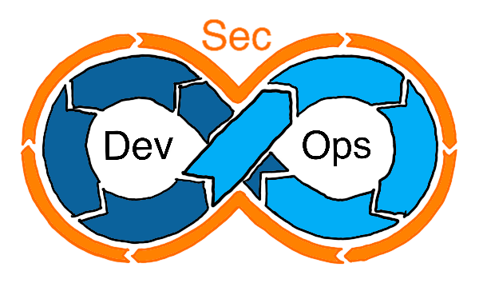

> **주의!**
> 이 글은 경력자로서 작성한 정보 전달의 글이 아닙니다.
> 공부한 내용을 정리하기 위한 글임을 명심해주시고,
> 관련하여 조언이 있으시면 언제든지 하단의 댓글을 통해 혹은 PR을 통해 아낌없는 조언 부탁드립니다.

이전 회사에서 개발하면서 DevOps를 사용하고 있었는데, 보안 전공자로서 모든 개발, 배포, 운영 과정에서 자연스럽게 보안에 대한 부분들을 고려하면서 개발했습니다. 그때는 *"당연히 모든 과정에서 보안 부분을 검토해야지"*하는 생각에 내가 DevSecOps를 하고 있다는 자각이 없었는데, 이후 DevSecOps를 알고 나니 좀 더 공부할 필요가 느껴졌습니다.

이 글은 그 이후에 관련된 직종으로 이직을 준비하면서 정리하는 글입니다.

## DevSecOps란

`DevSecOps = DevOps + Security`

기존에 보안은 개발의 최종단계로써 분리되었습니다. 그러나 보안이 개발 Pipeline에 유기적으로 결합 되어있지 않으면, 최종단계에서 보안 점검 중 심각한 보안 결함을 발견할 때 이는 개발 소스 전체에 영향을 줄 수 있는 Critical Risk입니다. 이러한 Risk는 며칠 혹은 몇 주의 개발 주기를 갖는 개발 환경에서 전체적인 효율성을 떨어뜨리는 원인으로 인식되었습니다. 따라서 이제는 협력적인 DevOps Framework에서 보안은 공동의 책임이며 처음부터 통합되어야 합니다.

즉, DevSecOps는 **처음부터 애플리케이션과 인프라 보안을 고려해야 한다**는 것입니다. 또한 DevOps 워크플로우가 느려지지 않도록 **보안 게이트를 자동화**해야 합니다.

## 좋은 DevSecOps를 구축하기 위해서는

1. 개발, 운영, 보안의 모든 부서가 **보안은 공동 책임**이라고 생각해야 한다.
2. 업무 프로세스 초기부터 **모든 개발자가 보안에 대한 이해를 바탕으로 개발**하며, 필요하다면 Secure Coding을 학습해야 한다.
3. DevOps CI/CD Pipeline에 효율성과 정확성을 위한 **보안 프로세스 자동화**가 필요합니다.
4. DevOps CI/CD Pipeline에 잘 융화될 수 있도록 **보안 프로세스 관련 Tools를 현명하게 선택**해야 합니다.

## 자동화를 통한 DevOps 보안

기업 환경에서의 서비스 규모가 거대해지고 다양한 개발 환경들이 제공되면서 개발자들은 더 다양하고 편리한 방법들을 도입하여 서비스와 개발 품질을 높이고 있습니다. 이런 환경 속에서 일일이 수동적인 보안 프로세스를 거치는 것은 프로세스 배포 주기를 늦추고 효율을 저하합니다.

따라서 DevOps 과정에서 반복적인 보안 테스트를 진행함으로써 보안 취약점 점검 과정을 단순화 할 수 있습니다.

### 장점

1. 관리상의 잘못과 실수가 줄어든다.
2. 보안 설계자가 보안 콘솔을 수동을 구성할 필요성을 줄여준다.
3. 지속해서 보안이 향상된다.

## 클라우드에서의 DevSecOps

점차 엔터프라이즈급의 개발환경이 클라우드 환경으로 변화됨에 따라 오픈되고 단일화된 API(like REST-API, GraphQL 등)이 제공되기 시작합니다. 이에 따라 보안에 대한 중요성도 증가하였습니다.

DevOps 개발 프로세스 내에서 보안 테스트를 진행할 수 있으며, 취약점을 점검할 수 있습니다. 이는 DevOps 프로세스가 진행되면서 점차 애플리케이션이 보안 측면에서 안전하게 되는 것을 의미합니다.

Reference.2의 글에서 "컨테이너 및 마이크로서비스를 위해 구축된 DevOps 보안"에 대한 섹션이 있는데 이 부분은 더이상 정리할 게 없을 정도로 잘 되어있기 때문에 링크를 따라 들어가 한번 읽는 것을 추천합니다.

## 결론

정리하면서 든 생각은 결론적으로 모든 개발 과정에서 *"보안은 마지막"*이라는 인식이 사라지는 것이다. 이는 개발한다, 운영한다는 의미 속에 전범위적으로 보안을 적용한다는 것이다. 즉, **"보안을 고려하여 개발하고 운영한다"**는 의미이다. 보안을 고려한다는 것은 쉬운 문제가 아닐 수 있다. 그러나 이 장벽은 더 나은 결과를 위한 투자에 불과할 것이다.

## Reference

1. [보안은 개발부터!! 데브섹옵스(DevSecOps) - LG CNS](https://blog.lgcns.com/2086)
2. [DevSecOps란 무엇일까요? - Red Hat](https://www.redhat.com/ko/topics/devops/what-is-devsecops)
3. [데브섹옵스를 시작하는 5가지 방법 - ITWorld Korea](http://www.itworld.co.kr/tags/71205/devsecops/110110)
4. [데브섹옵스란 무엇인가, 더 안전한 애플리케이션 개발하기 - ITWorld Korea](http://www.itworld.co.kr/tags/71205/devsecops/107841#csidx465ae649d145faba3d9b21b6090e90c )
