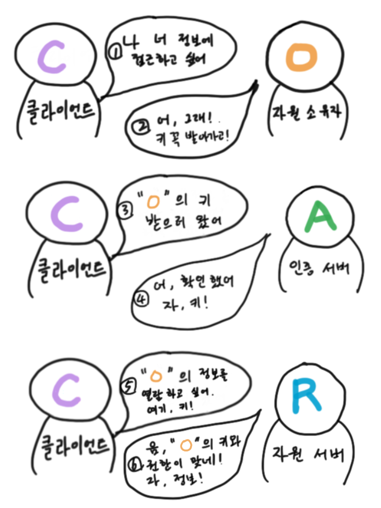

## Intro

> OAuth 2.0은 인증을위한 산업 표준 프로토콜입니다. OAuth 2.0은 2006 년에 작성된 원래 OAuth 프로토콜에 대한 작업보다 우선합니다. OAuth 2.0은 클라이언트 개발자의 단순성에 중점을 두면서 웹 응용 프로그램, 데스크톱 응용 프로그램, 휴대 전화 및 거실 장치에 대한 특정 권한 부여 흐름을 제공합니다. 이 사양 및 확장은 IETF OAuth Working Group 내에서 개발되고 있습니다. \- oauth.net의 소개글에서

OAuth 2.0은 [RFC에서 제의된 6749번 문서](https://tools.ietf.org/html/rfc6749)입니다.
OAuth 2.0은 기존의 1.0버전이 가진 보안 취약점, 인증 방식 등을 개선하여 대체하기 위하여 제시되었습니다.

저는 이전 직장에서 인증 과정을 도입하면서 여러가지 문제점에 부딪혔습니다.

- AWS Cognito/Auth0 같은 서드파티 서비스 이용금지(다양한 이유로)
- 자체적인 소셜 로그인 구조 필요
- Serverless 환경에서 세션 유지
- 안전하고 검증된 로그인/세션 필요
- 제3자에게 회사 서비스 API 접근 기능 구현
- 클라이언트-사이드/서버-사이드 병행 운용

오랜시간 고민하고 검색하면서 공부를 거듭하다가 구글, 페이스북, 네이버 같은 소셜서비스 제공 업체의 로그인 방식을 공부하다가 OAuth라는 인증 과정을 알게되었고 후에 여러 고려사항을 고민한 끝에 이 인증 방법을 도입하기로 결정하였습니다.

### OpenID와 OAuth

두 프로토콜 모두 인증을 위한 프로토콜임은 공통적인 성질로 가지고 있지만, OAuth의 경우 인증과 더불어 허가(인가)의 기능을 내포하고 있습니다. 사용자가 제3자의 서비스를 이용하여 리소스에 접근할 수 있습니다.

- 인증(Authentication): 사용자가 적법한 사용자인지 확인. 즉, 로그인
- 인가(Authorization): 사용자가 요청하는 작업에 적법한 권한을 주는 것. 즉, 권한 확인

예를들면...

> "나"(사용자)는 "Google"(리소스)의 소셜 로그인을 통해 "쇼핑몰"(제3자의 서비스)에 로그인했다. "쇼핑몰"은 "내"가 허락한 "Google"에서의 "내" 이름, 이메일, 전화번호를 읽을 수 있다.

### OAuth 1.0 그리고 OAuth 2.0

OAuth 1.0과 OAuth 2.0은 목적만 같은 완전히 다른 프로토콜입니다. 서로 호환도 안되며, 동시 운영할 필요도 없으며, 2.0 자체가 1.0을 대체하기 위해서 나온 프로토콜입니다. 그러므로 이 글에서는 OAuth 2.0만을 설명하겠습니다.

## 네가지 역할

OAuth 2.0에서는 네가지 역할이 등장합니다.

### Resource Owner(자원 소유자)

> resource owner: 
> An entity capable of granting access to a protected resource.
> When the resource owner is a person, it is referred to as an end-user.

**자원의 소유자.** 보호되는 자원에 가장 높은 접근이 가능한 실체입니다. 사람일 경우, 최종 사용자를 가리킵니다. _즉, 대부분의 경우 사용자_

### Resource Server(자원 서버)

> resource server: 
> The server hosting the protected resources, capable of accepting and responding to protected resource requests using access tokens.

**자원 서버.** 자원을 보호하는 호스팅 중인 서버입니다. 서버는 엑세스 토큰을 사용하여 보호 중인 자원에 대한 요청을 처리합니다. _예를 들어, 구글, 페이스북 같은 소셜 서비스 제공자_

### Client(클라이언트)

> client: 
> An application making protected resource requests on behalf of the resource owner and with its authorization. The term "client" does not imply any particular implementation characteristics (e.g., whether the application executes on a server, a desktop, or other devices).

**자원의 사용자.** "자원 소유자"를 대신하여 자원 소유자의 인가로 보호되는 자원에 요청하는 어플리케이션. "클라이언트"라는 용어는 특정 구현 특성(예컨데, 서버, 데스크탑, 혹은 다른 기기들 위에서 실행되는 어플리케이션)을 의미하지 않습니다. _예를 들어, 앱, 쇼핑몰, 게임 등 소셜 로그인 이용자(업체)_

### Authorization Server(권한 부여 서버)

> authorization server: 
> The server issuing access tokens to the client after successfully authenticating the resource owner and obtaining authorization.

**권한 부여 서버.** "자원 소유자"와 성공적인 인증과 권한 부여를 획득 후에 "클라이언트"에게 엑세스 토큰을 발행하는 서버. _예를 들어, 구글, 페이스북 같은 소셜 서비스 제공자의 권한 부여 서버_

"Resource Server"(자원 서버)와 "Authorization Server"(권한 부여 서버)는 같은 서버일 수도 있고 별개의 서버일 수도 있습니다. 그것은 개발자의 자유입니다. 상황과 환경에 맞춰서 구성하는 것이 좋습니다.

## Protocol Flow

이해하기 쉽게 그림을 그려왔습니다.(아이패드 짱짱)

차근히 살펴보자

1. 클라이언트는 자원 소유자에게 허가를 요청한다. 허가는 자원 소유자에게 바로 요청하거나 **권한 부여 서버가 중개자로서 간접적(바람직)**으로 이루어질 수 있습니다.
2. 클라이언트는 자원 소유자의 인가를 나타내는 권한 부여를 받습니다. 권한 부여 유형은 4가지 방식 중 하나를 사용하거나 확장된 유형으로 사용할 수 있습니다. 권한 부여 유형은 클라이언트의 요청과 권한 부여 서버가 지원하는 타입에 따라 다릅니다.
3. 클라이언트는 권한 부여 서버에게 권한 부여 허가에 따라 액세스 토큰을 요청합니다.
4. 권한 부여 서버는 클라이언트를 인증하고, 권한 부여 허가를 검증합니다. 만약 잘 되었다면, 액세스 토큰을 발행합니다.
5. 클라이언트는 자원 서버에게 보호된 자원을 요청합니다. 그리고 액세스 토큰으로 인증합니다.
6. 자원 서버는 액세스 토큰을 검증합니다. 만약 잘 되었다면, 클라이언트의 요청에 응답합니다.

2부에서는 대표적인 4가지 Authorization Grant의 흐름을 살펴보겠습니다.

## Reference

- [RFC 6749 - The OAuth 2.0 Authorization Framework](https://tools.ietf.org/html/rfc6749)
- [OAuth 2.0 대표 취약점과 보안 고려 사항 알아보기 : TOAST Meetup](https://meetup.toast.com/posts/105)
