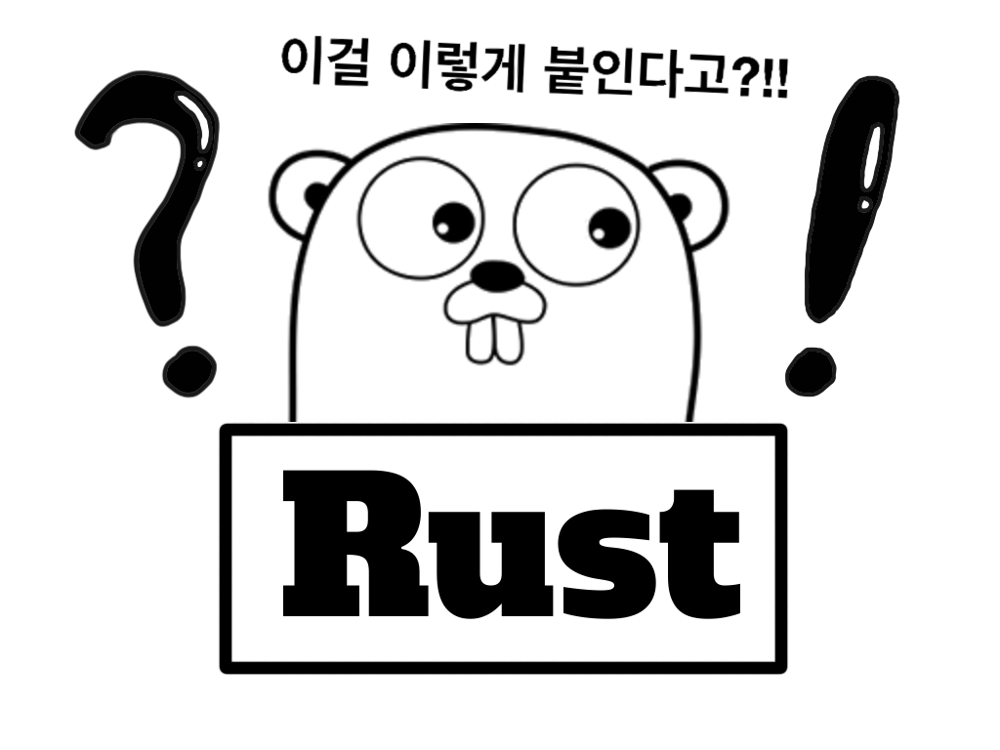

## Hello, World!, 안녕

우선, 문법을 보기에 앞서서 두 언어의 가장 기본이 되는 메인 함수를 한번 봐불까요?

```go
// main.go
package main

import "fmt"

func main() {
    fmt.Println("Hello, 안녕")
}
```

```rust
// main.rs
fn main() {
    println!("Hello, world!");
}
```

두 언어 다 `main()`이라는 함수로 호출하네요.

Go는 main 패키지에서부터 시작해서 `"fmt"` 패키지를 import해서 사용하고 있네요.
Rust는 main 함수만 작성했습니다. 첫 인상은 Rust가 시작이 간단해서 좋네요.

이어서 봐볼까요? 둘 다 console에 각각 "Hello, 안녕", "Hello, world!"를 출력해주고 있네요.
Go는 C언어처럼 fmt라는 패키지에서 `Println()`을 호출해서 사용하고 있네요.
Rust는 표준출력이 기본으로 빌트인된 함수인가 봅니다. `println!()`를 호출해서 사용하고 있습니다. 그리고 Go언어와는 다르게 식의 끝에는 `;`를 붙여줍니다.

### 컴파일

Go는 작업 디렉토리 안에서 `$ go build`를 실행하면 .go 확장자가 컴파일이 되어 실행 바이너리 파일이 output 됩니다.

Rust는 작업 디렉토리 안에서 `$ rustc main.rc`를 실행하면 .rs 확장자가 컴파일이 되어 실행 바이너리 파일이 output 됩니다.

둘 다 빌드는 간단하네요. 명령어도 간단합니다.

## 패키지

두 언어는 모두 패키지 개념을 가지고 있습니다. 의존성 라이브러리/패키지를 관리합니다.

### 패키지 관리자

각 언어에는 패키지 매니저가 있습니다. node.js의 npm/yarn 같은 친구입니다.

#### Go의 Go modules

Go는 1.11 버전부터 자체적으로 Go modules라는 패키지 매니저로 통합 되었습니다. 각 패키지 매니저에 대한 자세한 사용법은 나중에 분리해서 작성하고 여기는 가볍게 살펴보고 넘어가겠습니다.

- `go mod init`

Go modules가 생성하는 프로젝트 관리 파일은 `go.mod`입니다.

#### Rust의 Cargo

Rust는 Cargo라는 패키지 관리자가 있습니다. cargo는 node의 패키지 매니저처럼 프로젝트를 생성하고 스크립트를 실행하는 등의 작업을 할 수 있네요.

- `cargo new`
- `cargo build`
- `cargo run`

Cargo를 통해 프로젝트를 생성하면 `Cargo.toml`이라는 파일이 생성되는데 npm의 `package.json` 같은 프로젝트 관리 파일입니다.

### 패키지 사용법

#### Go

```go
// math.go
package main

import (
    "fmt"
    "math"
)

func main() {
    fmt.Println("Happy", math.Pi, "Day")
}
```

Go는 `import` 명령어를 이용해서 패키지를 가져올 수 있습니다. 위의 예시처럼 `import (~~~, ~~~~)` 콤마로 구분하셔도 되구요.

```go
import "fmt"
import "math"
```

이렇게 작성하셔도 됩니다.

패키지명은 디렉토리 경로의 마지막 이름만 사용하는 것이 규칙이라고 하네요.

> 예)
>
> 경로: `path/filepath`
>
> 사용: `import "filepath"`

또한, Go 언어에서는 패키지에서 함수나 변수, 상수 등을 패키지 외부로 내보내고 싶을 때 다른 예약어가 없이 첫 글자를 대문자로 작성해주어야 합니다. 위의 예제에서는 `math.Pi`를 자세히 보시면 p가 아니라 **P**입니다.

> 흠 이건 조금 호불호가 갈리겠네요. 전 좀더 사용해봐야 결정 할 듯 합니다.

#### Rust

이번엔 Rust를 살펴볼까요?

```rust
use std::io;

fn main() {
    println!("Guess the number!");

    println!("Please input your guess.");

    let mut guess = String::new();

    io::stdin().read_line(&mut guess)
        .expect("Failed to read line");

    println!("You guessed: {}", guess);
}
```

Rust는 `use` 예약어를 사용합니다. 예약어 뒤에 `std::io` 패키지 이름을 작성해줍니다. 여러 패키지를 쓰고 싶을 때는 줄바꿈 후에 `use ~~;`를 작성해주시면 됩니다.

```rust
use std::io;
use rand::Rng;
```

## 이번 글의 생각

제가 보기엔 두 케이스 모두 예약어 뒤에 하나의 패키지씩 작성하는게 보기 좋을 것 같아요. Go도 매 줄마다 ㅎㅎㅎㅎ

두 언어 모두 생소하거나 조금씩 저의 호불호가 갈리는 부분들이 있는데요.
Go의 경우 패키지에서 Export 할 때 첫글자를 대문자로 써준다는게 굉장히 낯서네요;;;; Rust의 경우에는 아직까지는 특별한 것은 없으나 `;`를 적어줘야 하는 부분이 좀 너무 올드하지 않나 하는 생각이 듭니다.

이번 글은 여기까지구요. 다음번엔 변수, 상수, 함수 같은 기본 프로그래밍 문법에 관하여 작성하겠습니다. 안녕!

## Reference

- [Go 패키지관리](https://www.joinc.co.kr/w/man/12/golang/mod)
- [A Tour of Go](https://go-tour-kr.appspot.com)
- [Hello, World! - The Rust Programming](https://doc.rust-lang.org/book/ch01-02-hello-world.html)
