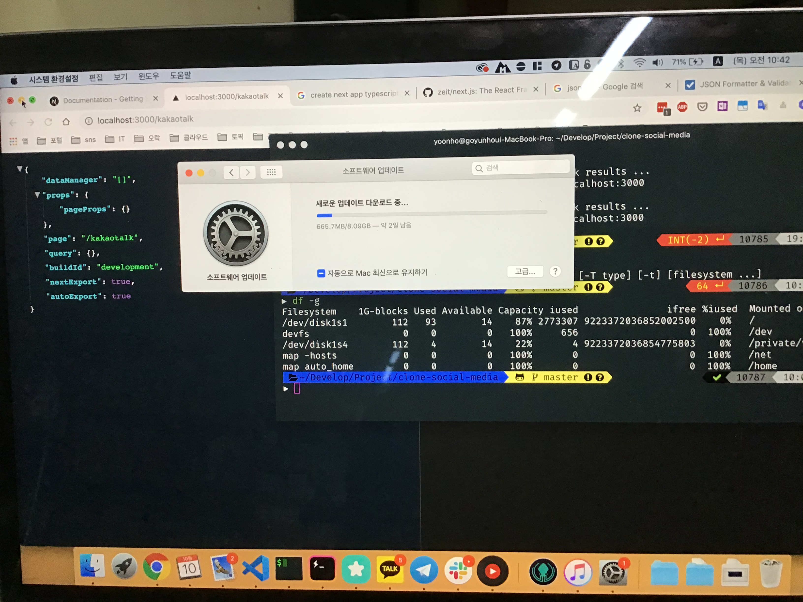
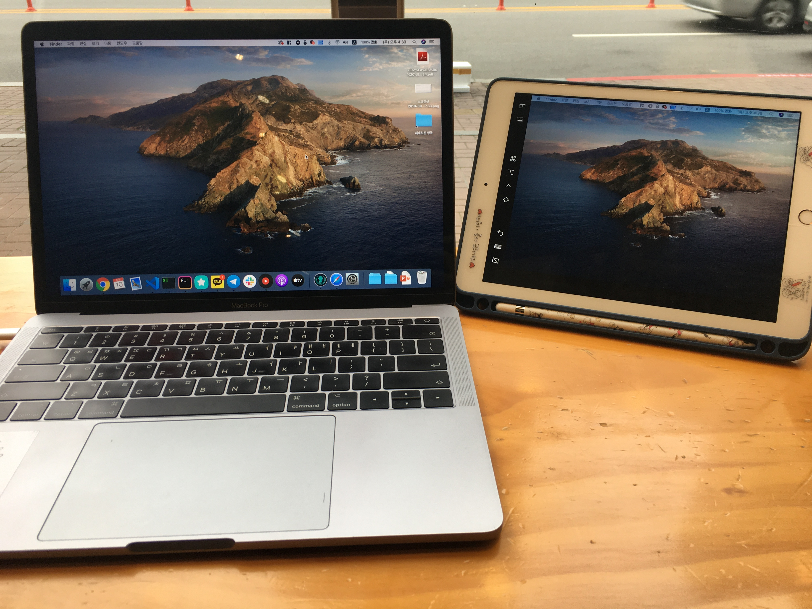

2019년 10월 7일에 macOS 카탈리나가 정식 출시 되었습니다. 저는 잊어 버리고 있다가 어제 유튜버들이 리뷰한걸 보고 오늘에서야 부랴부랴 업데이트했습니다. ㅎㅎㅎㅎ

<!--truncate-->

이번 업데이트에서 가장 기대했던 점은 개인적으로 Sidecar 기능인데요. iPad를 보조 모니터로 사용할 수 있는 기능입니다. 바로바로 듀얼 모니터!!! 세상에나 이젠 어디서나 듀얼모니터라니 넘 좋지 않나요? ㅠㅠㅠ 심지어 애플펜슬도 사용할 수 있어요.

아침에 눈뜨자마자 오전 중에 업데이트하려고 맥북을 열고 업데이트를 눌렀더니 이게 왠일... 한 700MB정도 받고나서부터는 점점 느려지더니 업데이트 시간이 무려 2일... 실화..?

마저 업데이트를 다 못하고 오후에 카페에서 업데이트를 진행해봤는데요. 스타벅스 효과인지, 시간이 지나서인지, 저희 집 네트워크가 문제였던건지 여기서는 순식간에 설치했습니다.

이번 업데이트로 정말 다양한 기능들이 추가되었는데요. [애플 홈페이지에서 확인할 수 있습니다.](https://www.apple.com/kr/macos/catalina/)

## Apple Music, Podcasts

iTunes에서 음악, 팟캐스트가 각각 Apple Music 앱과 Apple Podcasts 앱으로 분리되었습니다. 기존에 있던 기능들은 모두 그대로 사용 할 수 있으며, 동기화는 iCloud를 통해 백그라운드에서 자동으로 진행됩니다. 또한 Finder에서 기기를 직접 연결하여 관리할 수 있습니다.

## Mac Catalyst

개발자들이 기존 iPad 앱을 Mac용 앱으로 쉽게 포팅할 수 있게 되었습니다. 잠재적으로 굉장히 기대가 되는 기능입니다. 아직은 제공되는 앱이 별로 없을 것으로 생각되지만 유용한 iPad 앱이 Mac용으로 나오는 것들이 있으면 포스팅 해보겠습니다.

## 기본 앱의 변화

사진, 메모, 미리 알림, Safari가 기존 iOS와 iPadOS에서 업데이트된 것과 같이 macOS에서도 업데이트 되었습니다. 저는 지금 GoodNote와 MS OneNote를 주로 사용하고 있는데, 써봐야 알겠지만 만약 메모 기능이 카테고리 기능이라던가 태그 기능이 잘 지원된다면 옮겨가야겠네요.

## Sidecar

iPad를 Mac의 보조 디스플레이로 활용할 수 있습니다. 제가 제일 기다리던 기능!! 이제 어디서나 듀얼모니터로 작업할 수 있습니다. 넘넘 좋아요 ㅠㅠㅠ

심지어 애플 펜슬을 사용하면 화면에 펜슬로 그림도 그릴 수 있어요(아직 얼마나 필요한 기능인지는 아직 잘 모르겠지만요). 제 생각엔 크리에이터들에게 많이 필요한 기능인 것 같아요.

## 스크린타임

저에겐 별로 흥미 없는 기능 쿨하게 Pass!

## 보안 기능 강화

보안 기능이 강화되었습니다.

- macOS 설정 변경 보호
- 안전한 앱만 사용
- 데이터 접근 관리
- 도난시 더 쉽게 찾기
- Apple Watch를 통해 인증
- 등

## 음성 명령

이젠 음성 명령만으로 맥북을 사용하기 더욱 좋아졌습니다. 심지어 한국어도 지원해요! 대박쓰!! 열일하는 애플사. 벗어날 수 없다...

## 결론

이번 업데이트는 정말이지 심쿵하게 만드는 업데이트 같아요. 이래서 애플 제품만 쓰게 되는 것 같아요. 다음 업데이트가 계속 기다려집니다. ㅎㅎ 그럼 오늘 여기서 끝
